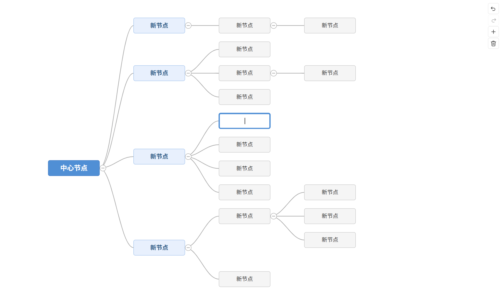

# Xiaodao MindMap

A feature-rich, interactive mind map component built with **Vue 3**, **TypeScript**, and **Vite**. Edit, expand, and navigate hierarchical mind map structures directly on an SVG canvas with full keyboard shortcut support, undo/redo, cut/copy/paste, collapse/expand, and internationalization.



## Features

- **Canvas-based editing** — click, double-click, pan, and edit nodes directly on an SVG canvas
- **v-model binding** — two-way data binding keeps the mind map data in sync with your application state
- **Light / dark theme** — toggle between light and dark modes via the `theme` prop
- **Internationalization (i18n)** — built-in Chinese (`zh-CN`) and English (`en-US`) translations, controlled via the `locale` prop
- **Undo / redo** — toolbar buttons and keyboard shortcuts with a 50-state history stack
- **Cut / copy / paste** — internal clipboard for cutting, copying, and pasting nodes within the canvas
- **Collapse / expand** — inline +/− toggle buttons on the right side of nodes with children
- **Keyboard shortcuts** — Tab, Enter, Delete, arrow keys, and standard Ctrl/Cmd combinations (see table below)
- **Canvas panning** — drag empty canvas areas to pan the viewport
- **Bezier curves** — smooth cubic Bezier connections between parent and child nodes
- **Tree layout algorithm** — automatic right-to-left tree layout with contour-based overlap avoidance
- **Depth-based styling** — root, level-2, and normal nodes have distinct visual styles
- **Inline text editing** — double-click any node to edit its text in place

## Installation

```bash
git clone <repository-url>
cd xiaodao-mindmap
npm install
```

## Quick Start

### Development

```bash
npm run dev
```

Opens the dev server at `http://localhost:5173` with hot module replacement.

### Build

```bash
npm run build
```

### Preview Production Build

```bash
npm run preview
```

## Usage

### Basic Example

```vue
<template>
  <MindMap v-model="mindMapData" />
</template>

<script setup lang="ts">
import { ref } from 'vue'
import MindMap from './components/mindmap/MindMap.vue'
import type { MindMapNode } from './components/mindmap/types'

const mindMapData = ref<MindMapNode>({
  id: 'root',
  text: 'Central Topic',
  children: [
    {
      id: 'c1',
      text: 'Branch 1',
      children: [
        { id: 'c1a', text: 'Leaf 1.1', children: [] },
        { id: 'c1b', text: 'Leaf 1.2', children: [] },
      ],
    },
    {
      id: 'c2',
      text: 'Branch 2',
      children: [],
    },
  ],
})
</script>
```

### Props

| Prop | Type | Default | Description |
|---|---|---|---|
| `modelValue` | `MindMapNode` | *required* | Root node of the mind map data tree |
| `theme` | `'light' \| 'dark'` | `'light'` | Color theme |
| `locale` | `string` | `'zh-CN'` | UI language (`'zh-CN'` or `'en-US'`) |

### Events

| Event | Payload | Description |
|---|---|---|
| `update:modelValue` | `MindMapNode` | Emitted whenever the mind map data changes |

### Data Structure

```typescript
interface MindMapNode {
  id: string       // Unique identifier (crypto.randomUUID())
  text: string     // Display text
  children: MindMapNode[]  // Child nodes
  collapsed?: boolean      // Whether children are hidden
}
```

## Keyboard Shortcuts

| Action | Windows / Linux | macOS |
|---|---|---|
| Undo | `Ctrl + Z` | `Cmd + Z` |
| Redo | `Ctrl + Y` | `Cmd + Shift + Z` |
| Cut node | `Ctrl + X` | `Cmd + X` |
| Copy node | `Ctrl + C` | `Cmd + C` |
| Paste node | `Ctrl + V` | `Cmd + V` |
| Add child node | `Tab` | `Tab` |
| Add sibling node | `Enter` | `Enter` |
| Delete node | `Delete` / `Backspace` | `Delete` / `Backspace` |
| Cancel editing / deselect | `Escape` | `Escape` |
| Select previous sibling | `↑` | `↑` |
| Select next sibling | `↓` | `↓` |
| Select parent node | `←` | `←` |
| Select first child | `→` | `→` |

> **Note:** Paste only works with content copied or cut from within the mind map canvas. Text from the system clipboard is ignored.

## Mouse Interactions

| Action | How |
|---|---|
| Select a node | Click on the node |
| Edit node text | Double-click on the node |
| Deselect | Click on empty canvas area |
| Pan the canvas | Drag on empty canvas area |
| Toggle collapse | Click the +/− button on a node's right side |

## Toolbar Buttons

Three vertically-arranged buttons are located at the top-right corner of the canvas:

| Button | Icon | Description |
|---|---|---|
| Undo | ↩ | Reverts the last action (disabled when nothing to undo) |
| Redo | ↪ | Re-applies the last undone action (disabled when nothing to redo) |
| Add child | ＋ | Adds a child node to the currently selected node |
| Delete | 🗑 | Deletes the currently selected node (disabled for root) |

## Project Structure

```
xiaodao-mindmap/
├── index.html                          # Entry HTML
├── package.json                        # Dependencies and scripts
├── vite.config.ts                      # Vite configuration
├── tsconfig.json                       # TypeScript configuration
├── tsconfig.node.json                  # TypeScript config for Vite
├── src/
│   ├── main.ts                         # App bootstrap
│   ├── App.vue                         # Demo app with theme/locale toggles
│   ├── style.css                       # Global reset styles
│   ├── env.d.ts                        # Vite/Vue type declarations
│   └── components/
│       └── mindmap/
│           ├── MindMap.vue             # Main mind map component
│           ├── types/
│           │   └── index.ts            # TypeScript type definitions
│           ├── i18n/
│           │   ├── zh-CN.ts            # Chinese translations
│           │   └── en-US.ts            # English translations
│           └── composables/
│               ├── useI18n.ts          # Internationalization composable
│               ├── useUndoRedo.ts      # Undo/redo stack management
│               ├── useClipboard.ts     # Cut/copy/paste clipboard
│               ├── useKeyboard.ts      # Keyboard shortcut handler
│               ├── useLayout.ts        # Tree layout algorithm
│               └── utils.ts            # Shared utilities (deepClone, generateId)
```

## Architecture

### Layout Algorithm

The tree layout uses a **contour-based overlap avoidance** algorithm:

1. Each subtree is measured recursively (depth-first), producing a layout `contour` — a map from depth level to the vertical `[min, max]` range occupied at that depth.
2. Sibling subtrees are arranged vertically by comparing their contours at every shared depth level, ensuring a consistent gap (`V_GAP = 20px`) at all levels.
3. After positioning, the parent node is centered vertically among its children.
4. Absolute coordinates are computed by accumulating parent offsets during a top-down flattening pass.

This prevents overlap between "cousin" nodes (e.g., a node's grandchildren overlapping with its sibling's children).

### Undo / Redo

- A snapshot of the entire tree is saved to the undo stack before each mutation.
- Stack size is capped at 50 entries (older entries are discarded).
- The redo stack is cleared whenever a new mutation is pushed.

### State Management

- The component maintains an internal deep-reactive copy of the `modelValue` prop.
- Mutations update the internal copy, then emit `update:modelValue` with a deep clone.
- External changes to `modelValue` are watched and synced into the internal copy.

## Dependencies

| Package | Version | Purpose |
|---|---|---|
| `vue` | `^3.4.0` | UI framework |
| `@vitejs/plugin-vue` | `^5.0.0` | Vite Vue plugin |
| `typescript` | `^5.4.0` | Type checking |
| `vite` | `^5.4.0` | Build tool and dev server |
| `vue-tsc` | `^2.0.0` | Vue TypeScript compiler |

## Browser Compatibility

Requires a modern browser with support for:

- `crypto.randomUUID()` (for node ID generation)
- SVG `foreignObject` (for inline text editing)
- CSS custom properties (for theming)

## License

MIT
